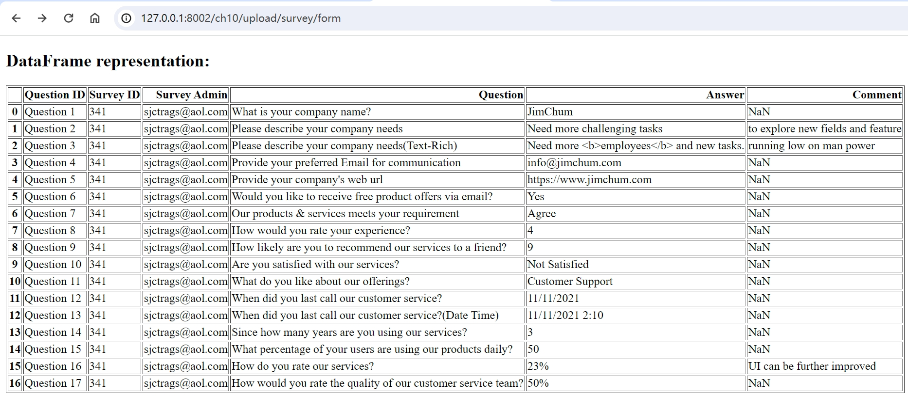

# 第10章 解决数值、符号和图形问题

项目背景：实现一个定期普查和计算系统的基本框架，该系统增强了特定国家不同地区的快速数据收集程序，提供创建和绘制数学模型、收集受访者的答案、提供问卷、创建工作流模板和使用图数据库等。

代码：`codes/ch10`

## 10.1 设置项目

项目说明：
- ch10-relational：使用PostgreSQL数据库和Piccolo ORM作为数据映射器。
- ch10-mongo：使用Beanie ODM将数据保存为Mongo DB文档。

使用Piccolo ORM：
- 创建项目：`piccolo app new`
- 创建数据模型并进行迁移：`piccolo migrations forward survey`

## 10.2 实现符号计算

- 实现方法：使用`sympy`模块执行符号计算。

- 创建符号表达式：

```python
@router.post("/sym/equation")
async def substitute_bivar_eqn(eqn: str, xval: int, yval: int):
    try:
        # 定义x和y对象
        x, y = symbols('x, y')
        # 将字符串方程转换为sumpy表达式
        expr = sympify(eqn)
        return str(expr.subs({x: xval, y: yval}))
    except:
        return JSONResponse(content={"message": "invalid equations"}, status_code=500)
```

- 求解线性表达式：

```python
@router.get("/sym/linear")
async def solve_linear_bivar_eqns(eqn1: str, sol1: int, eqn2: str, sol2: int):
    x, y = symbols('x, y')

    expr1 = parse_expr(eqn1, locals())
    expr2 = parse_expr(eqn2, locals())

    if Poly(expr1, x, y).is_linear and Poly(expr1, x, y).is_linear:
        eq1 = Eq(expr1, sol1)
        eq2 = Eq(expr2, sol2)
        sol = solve([eq1, eq2], [x, y])
        return str(sol)
    else:
        return None
```

- 求解非线性表达式：

```python
@router.get("/sym/nonlinear")
async def solve_nonlinear_bivar_eqns(eqn1: str, sol1: int, eqn2: str, sol2: int):
    x, y = symbols('x, y')

    expr1 = parse_expr(eqn1, locals())
    expr2 = parse_expr(eqn2, locals())

    if not Poly(expr1, x, y).is_linear or not Poly(expr1, x, y).is_linear:
        eq1 = Eq(expr1, sol1)
        eq2 = Eq(expr2, sol2)
        sol = solve([eq1, eq2], [x, y])
        return str(sol)
    else:
        return None
```

## 10.3 创建数组和DataFrame

- 使用`numpy`的`array`创建数组：

```python
@router.get("/answer/increase/{gradient}")
async def answers_weight_multiply(gradient: int, qid: int):
    repo_loc = LocationRepository()
    repo_answers = AnswerRepository()
    locations = await repo_loc.get_all_location()
    data = []
    for loc in locations:
        loc_q = await repo_answers.get_answers_per_q(loc["id"], qid)
        if not len(loc_q) == 0:
            loc_data = [weights[qid - 1][str(item["answer_choice"])] for item in loc_q]
            data.append(loc_data)
    arr = np.array(list(itertools.chain(*data)))
    arr = arr * gradient
    return ujson.loads(ujson.dumps(arr.tolist()))
```

- 使用`pandas`的`DataFrame`创建数据集：

```python
@router.get("/answer/all")
async def get_all_answers():
    repo_loc = LocationRepository()
    repo_answers = AnswerRepository()
    locations = await repo_loc.get_all_location()
    temp = []
    data = []
    for loc in locations:
        for qid in range(1, 13):
            loc_q1 = await repo_answers.get_answers_per_q(loc["id"], qid)
            if not len(loc_q1) == 0:
                loc_data = [weights[qid - 1][str(item["answer_choice"])] for item in loc_q1]
                temp.append(loc_data)
        temp = list(itertools.chain(*temp))
        if not len(temp) == 0:
            data.append(temp)
        temp = list()
    arr = np.array(data)
    # 返回json格式
    return ujson.loads(pd.DataFrame(arr).to_json(orient='split'))
```

## 10.5 执行统计分析

使用`scipy`包的`describe()`计算数据的均值（mean）、方差（variance）、偏度（skewness）和峰度（kurtosis）。

```python
@router.get("/answer/stats")
async def get_respondent_answers_stats(qid: int):
    repo_loc = LocationRepository()
    repo_answers = AnswerRepository()
    locations = await repo_loc.get_all_location()
    data = []
    for loc in locations:
        loc_q = await repo_answers.get_answers_per_q(loc["id"], qid)
        if not len(loc_q) == 0:
            loc_data = [weights[qid - 1][str(item["answer_choice"])] for item in loc_q]
            data.append(loc_data)
    # 统计分析        
    result = stats.describe(list(itertools.chain(*data)))
    return json.dumps(result._asdict(), default=ConvertPythonInt)
```

## 10.6 生成CSV和XLSX报告

- 使用`read_csv()`读取CSV文件，并将其序列化为HTML表格格式的内容：

```python
@router.get("/upload/survey/form", response_class=HTMLResponse)
def upload_survey_form(request: Request):
    # 用html渲染
    return templates.TemplateResponse("upload_survey.html", {"request": request})


@router.post("/upload/survey/form")
async def submit_survey_form(request: Request, file: UploadFile = File(...)):
    # 读取CSV文件
    df = pd.read_csv(StringIO(str(file.file.read(), 'utf-8')), encoding='utf-8')
    return templates.TemplateResponse('render_survey.html', {'request': request, 'data': df.to_html()})
```



## 10.7 模拟BPMN工作流

代码：`codes/ch10/ch10-mongo/api/survey_workflow.py`

- 实现方法：基于Celery的`chain()`方法可以链接任务执行的工作流，其中每个父任务将结果返回给下一个任务的第一个参数。

```python
@router.post("/survey/compute/avg")
async def chained_workflow(surveydata: SurveyDataResult):
    survey_dict = surveydata.model_dump(exclude_unset=True)
    print(survey_dict)
    result = chain(compute_sum_results.s(survey_dict['results']).set(queue='default'),
                   compute_avg_results.s(len(survey_dict)).set(queue='default'),
                   derive_percentile.s().set(queue='default')).apply_async()
    return {'message': result.get(timeout=10)}
```
